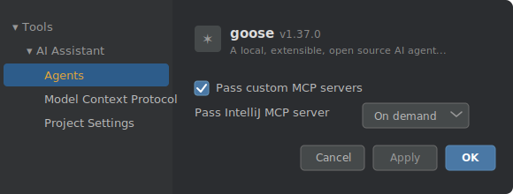
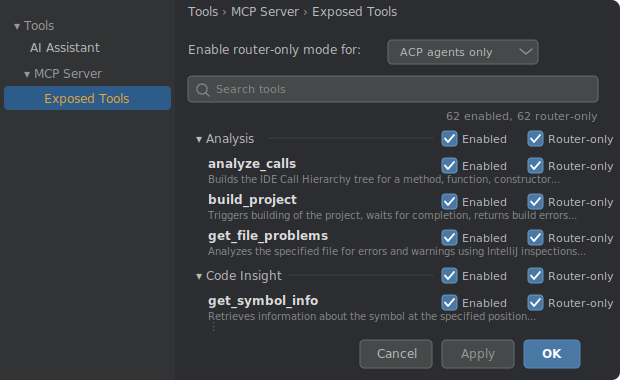
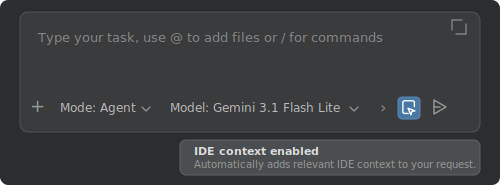
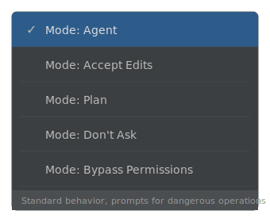

# agy-acp

ACP (Agent Client Protocol) adapter that wraps Google's [Antigravity SDK](https://antigravity.google/blog/introducing-google-antigravity-sdk) to run as a coding agent in JetBrains IDEs and Zed via [ACP](https://agentclientprotocol.com/).

### Background

The Antigravity SDK (`pip install google-antigravity`) launched at [I/O 2026](https://antigravity.google/blog/introducing-google-antigravity-2-0) as part of the Antigravity 2.0 platform (desktop app, [CLI](https://antigravity.google/blog/introducing-google-antigravity-cli), SDK, Managed Agents API, Enterprise Agent Platform). The CLI [succeeded Gemini CLI](https://developers.googleblog.com/an-important-update-transitioning-gemini-cli-to-antigravity-cli/) in June 2026. Community discussion: [SDK announcement](https://www.reddit.com/r/google_antigravity/comments/1thxpmr/google_antigravity_sdk/), [unofficial Antigravity SDK](https://github.com/Kanezal/antigravity-sdk) (TypeScript, AGPL-3.0 — for building Antigravity IDE extensions, [thread](https://www.reddit.com/r/google_antigravity/comments/1rh2yhg/i_built_the_first_community_sdk_for_google/)).

> **API key, not Antigravity login.** This project uses a Gemini API key (from [AI Studio](https://aistudio.google.com/apikey) or Vertex). Using third-party software with an Antigravity account [violates Google's TOS](https://antigravity.google/docs/faq#why-cant-i-use-third-party-software-eg-claude-code-openclaw-opencode-with-my-antigravity-login) and may result in account termination.

## Prerequisites

- macOS (Linux likely works; Windows is not supported — symlinks used for skill discovery)
- Python 3.14+
- [uv](https://docs.astral.sh/uv/) package manager
- `GEMINI_API_KEY` environment variable (get one from [AI Studio](https://aistudio.google.com/apikey))

## Setup

```bash
uv sync
```

## Running

The agent communicates over stdio using the ACP JSON-RPC protocol. To run standalone:

```bash
python hellp.py
```

### IntelliJ / JetBrains IDEs

Add the agent to `~/.jetbrains/acp.json`
([docs](https://www.jetbrains.com/help/ai-assistant/acp.html#add-custom-agent)):

```json
{
  "agent_servers": {
    "Antigravity": {
      "command": "/path/to/.venv/bin/python",
      "args": ["/path/to/hellp.py"],
      "env": {
        "GEMINI_API_KEY": "your-key-here"
      }
    }
  }
}
```

The agent appears in the AI Chat tool window (look for the agent icon).

#### Enabling terminal support

Terminal/command execution is gated behind a registry flag in IntelliJ's ACP plugin (disabled by default in 2026.2 EAP builds):

1. **Help > Find Action** (Cmd+Shift+A) > type `Registry`
2. Search for `llm.chat.agent.acp.terminal.enabled`
3. Check the box
4. Restart the ACP session (or the IDE)

Without this, the IDE sends `terminal=False` in its client capabilities and the agent falls back to the SDK's native command execution (commands run outside the IDE terminal UI).

### Zed

Add the agent to your Zed settings ([docs](https://zed.dev/docs/ai/external-agents#custom-agents)):

**Settings > Extensions > Agent Servers**, or edit `~/.config/zed/settings.json`:

```json
{
  "agent": {
    "custom_agents": [
      {
        "id": "antigravity",
        "name": "Antigravity",
        "command": "/path/to/.venv/bin/python",
        "args": ["/path/to/hellp.py"],
        "env": {
          "GEMINI_API_KEY": "your-key-here"
        }
      }
    ]
  }
}
```

## IDE tools (IntelliJ MCP server)

IntelliJ exposes IDE tools (build, inspections, symbol info, refactoring, debugger, etc.) via a built-in [MCP server](https://www.jetbrains.com/help/idea/mcp-server.html). The recommended way to connect these to the agent is via streamable-http as a custom MCP server, **not** via `use_idea_mcp` in `acp.json`.

**Why not `use_idea_mcp`?** It passes the IDE's MCP server in router-only mode, exposing a single `execute_tool` wrapper with no tool schemas. The LLM struggles with this indirection. It also spawns a redundant `idea stdioMcpServer` process.

**Recommended setup:**

1. In IntelliJ, go to **Settings > Tools > MCP Server**
2. Under Manual Client Configuration, click **Copy HTTP Stream Config**
3. Paste into `.ai/mcp/mcp.json` in your project root (or create the file):

```json
{
  "mcpServers": {
    "idea": {
      "type": "streamable-http",
      "url": "http://127.0.0.1:<port>/stream",
      "headers": {
        "IJ_MCP_SERVER_PROJECT_PATH": "/path/to/your/project"
      }
    }
  }
}
```

4. In **Settings > AI Assistant > Agents**, ensure **Pass custom MCP servers** is checked



This gives the agent individual tools with full schemas. Key tools ([full list](https://www.jetbrains.com/help/ai-assistant/mcp.html#supported-tools)):

| Category | Tools |
|----------|-------|
| Analysis | `build_project`, `get_file_problems`, `get_project_dependencies` |
| Code Insight | `get_symbol_info` |
| Refactoring | `rename_refactoring`, `reformat_file` |
| Search | `search_symbol`, `search_text`, `search_regex` |
| Execution | `execute_run_configuration`, `execute_terminal_command` |
| VCS | `get_repositories`, `git_status` |
| Debugger | via [`ij-debugger` skill](https://www.jetbrains.com/help/idea/mcp-server.html) (Find Action > "Copy Debugger Skill to Agents") |

Toggle individual tools on/off in **Settings > Tools > MCP Server > Exposed Tools**.

Notable gaps in the built-in MCP server (as of 2026.1):

- **No `find_usages`** — semantic "find all references" (Alt+F7) is not exposed. Agents fall back to `search_text`/`search_regex` (grep), which misses scope, overrides, and type hierarchy. Tracked in [IJPL-199607](https://youtrack.jetbrains.com/issue/IJPL-199607).
- **No advanced refactoring** — only `rename_refactoring` exists. Extract method/variable/file are missing, so agents do multi-file refactors manually (slow, context-heavy). Tracked in [IJPL-216136](https://youtrack.jetbrains.com/issue/IJPL-216136).

Third-party plugins that fill these gaps ([discussion](https://www.reddit.com/r/Jetbrains/comments/1t48pap/is_intellijs_mcp_server_just_completely_useless/)):

| Plugin | Find usages | Refactoring | License |
|--------|-------------|-------------|---------|
| [IDE Index MCP Server](https://plugins.jetbrains.com/plugin/29174-ide-index-mcp-server) ([source](https://github.com/hechtcarmel/jetbrains-index-mcp-plugin)) | `ide_find_references`, `ide_find_implementations`, `ide_type_hierarchy` | `ide_refactor_rename` | Apache-2.0 |
| [AgentBridge](https://plugins.jetbrains.com/plugin/30415-agentbridge) ([source](https://github.com/catatafishen/agentbridge)) | `find_references`, `find_implementations`, `get_call_hierarchy` | 120+ tools including IDE-native editing | Apache-2.0 |
| [MCP Steroid](https://mcp-steroid.jonnyzzz.com/) ([source](https://github.com/jonnyzzz/mcp-steroid)) | via `steroid_execute_code` (runs Kotlin against IntelliJ APIs) | same approach — scripted access to all IDE APIs | Apache-2.0 |
| [IntelliJ Agent CLI](https://github.com/Haehnchen/idea-intellij-cli) | `find_references` via HTTP API + Go CLI | yes | no license |



## Diagnostics

### IntelliJ

With the MCP server configured (see above), the agent can call `build_project` for build errors and `get_file_problems` for inspections/warnings.

### Zed

External ACP agents [cannot access Zed's LSP diagnostics](https://github.com/zed-industries/zed/discussions/58546). Workaround: the agent can run linters via `run_command` (e.g. `tsc --noEmit`, `cargo check`).

For Go: [gopls v0.20+](https://go.dev/gopls/features/mcp) has built-in MCP mode with a `go_diagnostics` tool that can be configured as an MCP server.

## IDE context

Both IDEs can enrich prompts with editor state (open file, selection).

### IntelliJ

The "IDE context enabled" toggle in the chat bottom bar controls this. When enabled, IntelliJ adds two extra prompt blocks alongside your message:

- A **resource link** with the open file's URI (no file content)
- A **resource** with selection byte offsets (JSON, ~250 bytes)

The agent reads the file via `view_file` only if needed. No full file content is sent automatically.



### Zed

Zed automatically includes active buffer context. Use `@` mentions to explicitly attach files, diagnostics, or symbols.

## Modes

The agent supports 5 permission modes that control how tool calls are handled:



| Mode | Read tools | File writes | Commands / MCP | Notes |
|------|-----------|-------------|----------------|-------|
| **Agent** (default) | auto-allow | prompt | prompt | Standard behavior |
| **Accept Edits** | auto-allow | auto-allow | prompt | Auto-accepts file changes |
| **Plan** | auto-allow | deny | prompt | File writes disabled, exploration OK |
| **Don't Ask** | auto-allow | deny | deny | Silently denies non-safe tools |
| **Bypass** | auto-allow | auto-allow | auto-allow | No permission checks |

Switch modes via the Mode dropdown in the IDE, or via `set_session_mode` / `set_config_option` RPCs.

## Subagents

The agent supports subagents via the Antigravity SDK's `START_SUBAGENT` builtin tool (enabled with `enable_subagents=True` in `CapabilitiesConfig`).

### Built-in subagent types

| Type | Purpose |
|------|---------|
| `research` | Read-only codebase exploration, preserves parent's context window |
| `self` | Clone of the calling agent with identical tools and system prompt |

Custom subagent types can be defined at runtime via `define_subagent` with a custom `system_prompt` and permission flags:

- `enable_write_tools` — file create/edit and command execution
- `enable_mcp_tools` — access to parent's MCP servers (e.g. IDE tools)
- `enable_subagent_tools` — ability to spawn nested subagents

### Known limitations

- **MCP tool isolation is broken** — `enable_mcp_tools: false` does not restrict access; subagents always inherit the parent's MCP connections regardless of the flag ([SDK issue #65](https://github.com/google-antigravity/antigravity-sdk-python/issues/65))
- **No per-subagent permission modes** — the parent's permission mode applies globally; you can't give a subagent a more restrictive mode
- **No conversation inheritance** — subagents start with a clean context window (by design, to preserve the parent's context)

### Hooks

Subagent lifecycle is visible through the standard `PreToolCallDecideHook` and `PostToolCallHook` — the tool name is `start_subagent`. See the SDK example at [`examples/getting_started/subagents.py`](https://github.com/google-antigravity/antigravity-sdk-python/blob/main/examples/getting_started/subagents.py).

## IntelliJ-specific behavior

The agent detects IntelliJ via `client_info.name` containing "JetBrains" and adjusts:

- `/model` and `/thinking` slash commands tell IntelliJ users to use the IDE dropdown instead (IntelliJ has a config feedback loop that overwrites agent-initiated changes)
- The config feedback loop (IDE echoes back current values after each prompt) is handled by short-circuiting `set_config_option` when the value hasn't changed, avoiding unnecessary agent rebuilds

## Testing

```bash
# Offline tests (no API key needed)
python -m pytest hellp_test.py -k 'not test_initializes and not test_live_run'

# All tests (requires GEMINI_API_KEY)
python -m pytest hellp_test.py
```

## Architecture

`EchoAgent` extends `acp.Agent` and wraps `google.antigravity.Agent`:

```
IDE (IntelliJ/Zed) <--ACP JSON-RPC--> EchoAgent <---> Session ──> Antigravity Agent ──> Gemini API
                                           |              |
                                           |              +-- Go harness (subprocess, 1 per session)
                                           |              +-- trajectory file (conversation state)
                                           |
                                           +-- view_file/create_file/edit_file --> IDE RPCs
                                           +-- run_command --> IDE terminal (if supported)
                                           +-- PreToolCallDecideHook --> permission broker
```

Each ACP session owns its own `Session` object containing an Antigravity `Agent` instance with its own Go harness subprocess. Sessions are isolated — closing one doesn't affect others, and concurrent sessions don't interfere.

- **File I/O** is routed through IDE RPCs (`read_text_file`, `write_text_file`) when the client supports it, otherwise falls back to the SDK's built-in tools.
- **Command execution** goes through the IDE terminal when `client_capabilities.terminal=True`, otherwise the SDK's native `run_command` handles it.
- **Permission gating** is mode-dependent: read-only tools always auto-allow; file writes and command execution behavior depends on the active mode (see below).

### Session persistence

Conversation history is saved as trajectory files in `~/.agy-acp/trajectories/` by the Go harness during graceful shutdown. On session resume (`load_session` / `resume_session`), the agent checks if the trajectory file exists and resumes from it. If the file is missing (e.g., process was killed without cleanup), the session starts fresh.

**Known limitation:** Zed sends `SIGKILL` to agent processes on disconnect ([zed#59323](https://github.com/zed-industries/zed/issues/59323)), bypassing all cleanup. Trajectories are never saved, so session resume always starts fresh in Zed. The SDK also lacks a mid-session save API ([SDK#68](https://github.com/google-antigravity/antigravity-sdk-python/issues/68)). IntelliJ handles this correctly by closing stdin, allowing graceful shutdown.

## Features

- **Models**: Gemini 3.5 Flash (default), 3.1 Pro, 2.5 Pro/Flash/Flash-Lite, and more
- **Thinking** (`thinking_level`): Minimal/Low/Medium/High (3.x models only)
- **Modes**: Agent (default, prompts for writes/commands), Accept Edits (auto-allows file edits), Plan (read-only, no file writes), Don't Ask (deny non-safe silently), Bypass (allow everything)
- **Sessions**: Create, list, load, fork, resume with conversation persistence
- **MCP servers**: HTTP, SSE, and stdio transports (with env variable workaround)
- **Cost tracking**: Per-turn and cumulative USD estimates with long-context surcharge
- **Context retention**: Compact (25k), Normal (50k), Extended (200k), Max (1M) token thresholds
- **Slash commands**: `/reset`, `/clear`, `/cost`, `/usage`, `/model [id]`, `/thinking [level]`, `/context [level]`, `/compact`, `/help`
- **Authentication**: `GEMINI_API_KEY` env var via ACP auth flow

## Files

| File | Description |
|------|-------------|
| `hellp.py` | Main ACP adapter — `EchoAgent` and hook implementations |
| `hellp_test.py` | Test suite (offline + live tests) |
| `fake_server.py` | Fake agent server for subprocess integration tests |
| `hello.py` | Standalone Antigravity SDK example (no ACP) |
